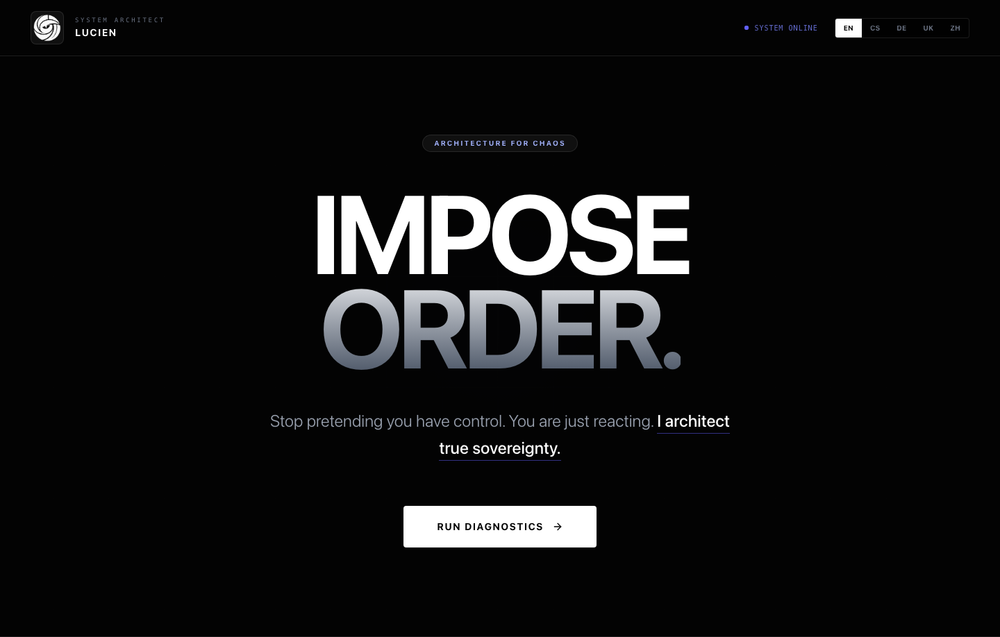
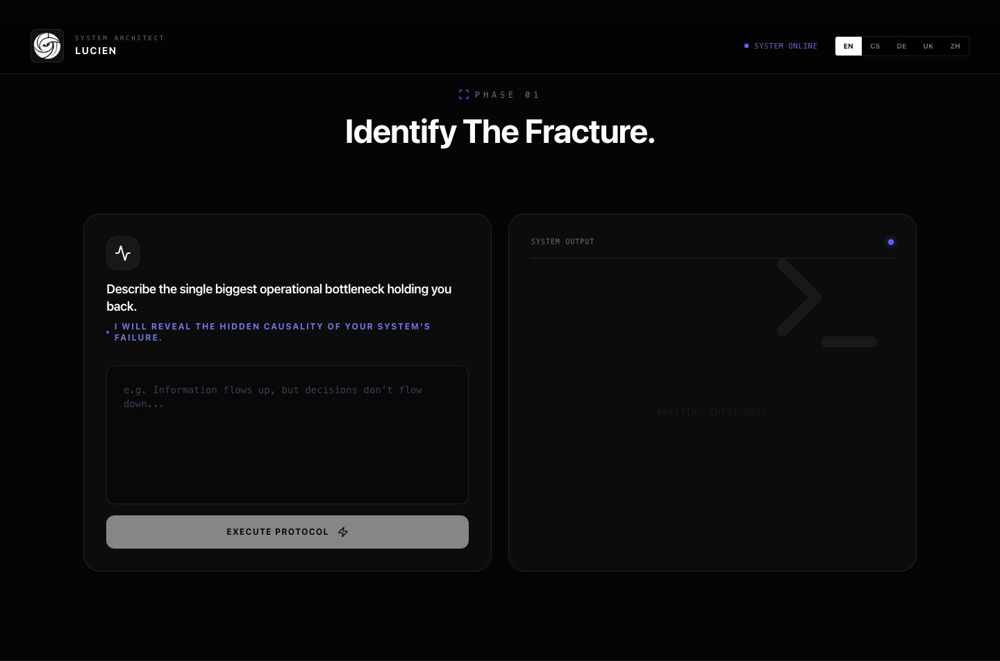
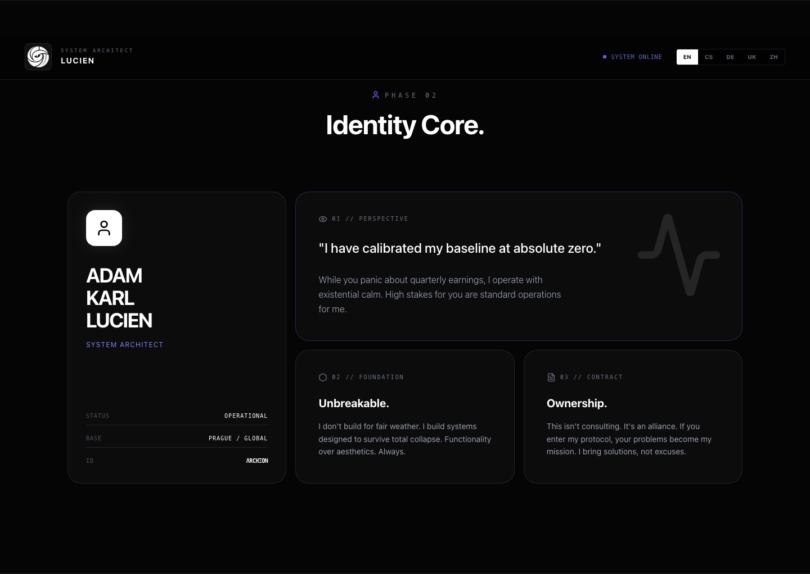
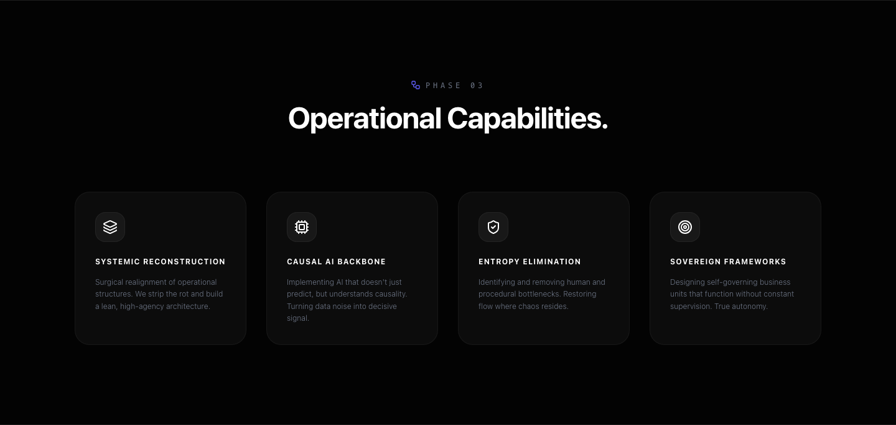
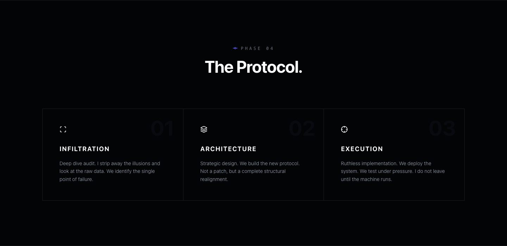
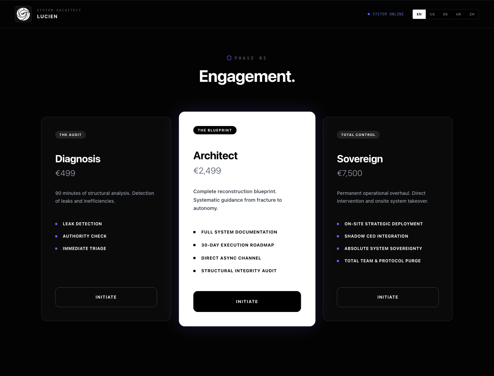
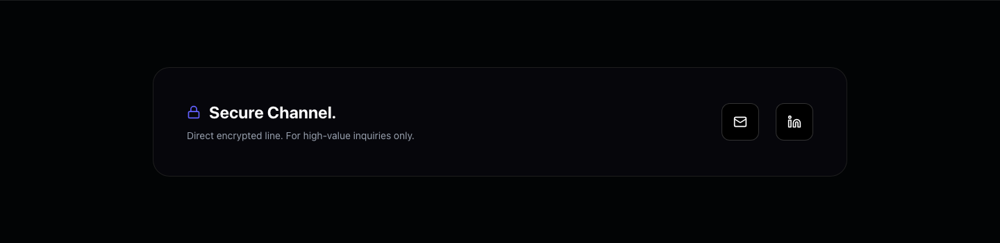
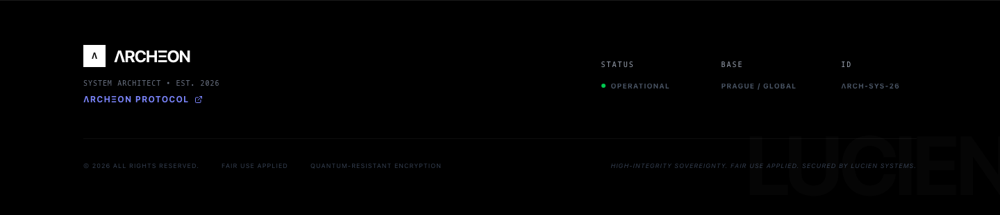

# Visual Guidelines (Lucien Sovereign)

Purpose: This document defines the visual system so any AI can extend the UI without breaking the aesthetic. Keep the output cinematic, surgical, and high-contrast.

## Visual Identity

- Mood: cold, authoritative, high-end, cinematic, clinical.
- Theme: "void + indigo signal". Dark base, soft glow, precise grids, minimal noise texture.
- Texture: subtle noise overlay + faint grid + radial glow tied to cursor.

## Screenshots (All Sections)

### Navbar

### Hero

### Audit (AI Scanner)

### Identity

### Capabilities

### Protocol

### Pricing

### Contact

### Footer

## Core Layout Rules

- The site is a single-page narrative with stacked sections.
- Max content width: 1200px (most sections) or 1400px (navbar). Use `mx-auto`.
- Section vertical rhythm: large spacing. Typical paddings:
  - Hero: `pt-48 pb-32`
  - Primary sections: `py-32` or `py-40`
  - CTA/contact: `py-24`
  - Footer: `py-16`
- Horizontal padding: `px-6` globally for sections.
- Layout structure: flex + grid. Most grids use `md:` or `lg:` breakpoints.

## Background System

Primary background layers live in `src/App.jsx`:

1) Base background
- Root container: `bg-[#030303]`.

2) Noise overlay
- Fixed fullscreen div with `mix-blend-overlay` and low opacity (0.04).
- Inline SVG noise via `data:image/svg+xml`.

3) Dynamic glow + grid
- Fixed div with:
  - `radial-gradient` centered on mouse position.
  - Two subtle 1px linear grids.
  - Opacity ~0.10.

These three layers define the signature look. Keep them as-is unless redesigning the entire brand.

## Color System

Primary colors (hex values are used directly in classes or inline styles):

- Void base: `#030303`
- Deep surface: `#050505`
- Panel surface: `#0c0c0c`
- Edge dark: `#0a0a0a`
- Input dark: `#080808`
- Input darker: `#111`
- Accent: Indigo (Tailwind `indigo-400/500`). Examples:
  - `text-indigo-400`, `bg-indigo-500`, `border-indigo-500/50`
- Secondary accents:
  - `text-white`, `text-gray-400`, `text-gray-500`, `text-gray-600`, `text-gray-700`
  - Status: `bg-green-500` used in footer status dot

Rules:
- Use neutral grays for most copy and details.
- Reserve indigo for signal, CTA hover, or system highlights.
- Borders are subtle: `border-white/10` or `border-white/5`.
- Shadows are glow-based, not hard drop shadows.

## Typography

Current font setup is minimal:

- Global `:root` font family is `Inter, system-ui, ...` in `src/index.css`.
- No external font files are loaded in `index.html`.
- Typography style is created by Tailwind utilities:
  - Uppercase headings, wide tracking: `uppercase`, `tracking-widest`.
  - Serif is not used; `font-sans` and `font-mono` only.

Usage patterns:
- Hero title: huge, tightly tracked, mostly uppercase.
- Micro labels: `text-[9px]` to `text-xs`, uppercase, mono, wide tracking.
- Body copy: `text-sm` to `text-xl`, light gray, light weight.

If a custom font is added later, update `index.html` and `src/index.css`.

## Spacing + Radius

- Most cards use large rounding: `rounded-2xl` or `rounded-3xl`.
- Buttons are usually `rounded-xl` or `rounded-sm` depending on intent.
- Internal spacing is generous: cards typically use `p-8` to `p-12`.

## Component Styling Rules

### Navbar
- Fixed, transparent black with blur: `bg-[#030303]/80 backdrop-blur-md`.
- Left: logo block (square) + role + name.
- Right: status pulse + language switcher.
- Language buttons: active = white background + black text.

### Hero
- Badge: small pill, blur, thin border, indigo text.
- Title: massive, two-line with gradient on second word.
- CTA: white button -> indigo hover, with glow.

### Audit (AI Scanner)
- Two-column grid.
- Left: input card with mono textarea.
- Right: output panel with terminal vibe and animated pulse.
- Output uses a fade-in animation class (custom keyframes not defined yet).

### Identity
- Card grid with hover reveal on the left profile card.
- Profile card flips to a bio list on hover.

### Capabilities / Protocol
- Repeating cards, consistent padding and borders.
- Icons in small rounded blocks.

### Pricing
- Three tiers, middle one is emphasized (white background and scale).
- Buttons: inverted depending on tier.

### Contact
- CTA block with soft indigo sweep on hover.
- Contact buttons are icon-only, square, with hover glow.

### Footer
- Large faint background word.
- Small, uppercase metadata and status dot.

### Modals
- Fullscreen blur overlay.
- Card with heavy border and glow shadow.
- Buttons are high contrast (white or indigo hover).

## Motion + Interactions

Standard motion utilities:
- `transition-all` with `duration-300` to `duration-700`.
- `hover:-translate-y-1` for cards.
- `animate-pulse` used for status and system indicators.
- Custom classes `animate-[fadeIn_0.3s_ease-out]` and `animate-[fadeIn_0.5s_ease-out]` are used, but `@keyframes fadeIn` is not defined. If you rely on this effect, add the keyframes to `src/index.css` or Tailwind config.

## Iconography

- Icons are from `lucide-react` (outline style).
- Always use small sizes (12px to 24px) and keep them monochrome.

## Images and Logos

- Primary logo lives in `public/image1.svg`.
- Navbar currently uses a square logo container; keep the ratio inside.

## Responsiveness

- Mobile-first. Key breakpoints are `md` and `lg`.
- Some desktop-only elements are hidden on smaller screens (e.g., status indicator and one footer column).
- Ensure CTAs and cards stack on small screens without reducing contrast.

## Do / Do Not

Do:
- Keep the void + indigo aesthetic.
- Use subtle borders and large padding.
- Maintain high contrast between text and background.

Do not:
- Introduce bright multi-color palettes.
- Use playful rounded buttons or pastel UI styles.
- Add heavy drop shadows or skeuomorphic effects.
